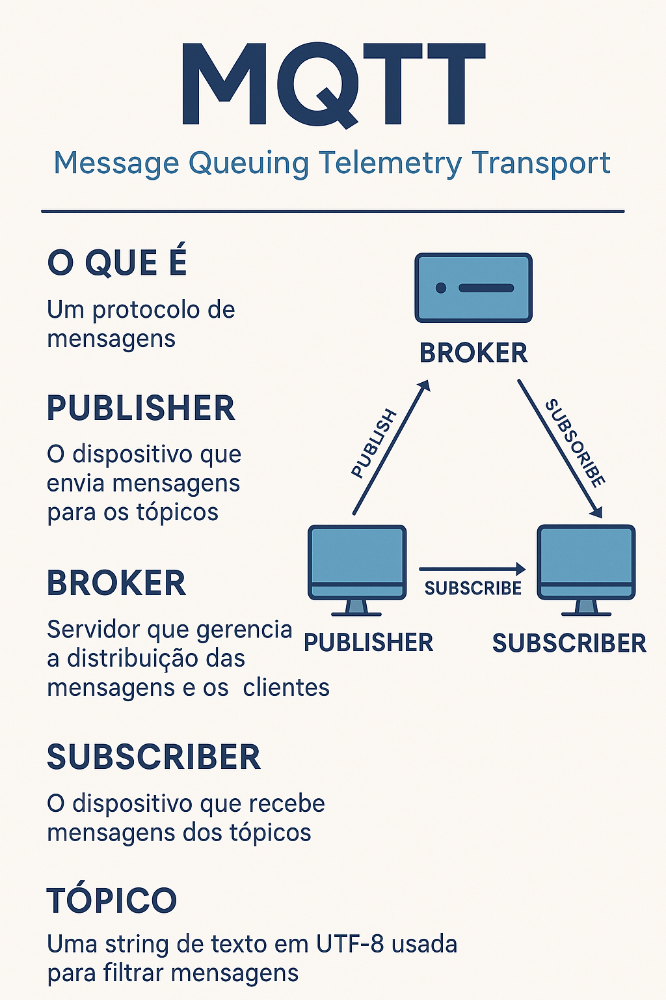

# 🧠 Introdução ao MQTT

**MQTT (Message Queuing Telemetry Transport)** é um protocolo de mensagens leve, projetado para comunicação entre dispositivos em redes com largura de banda limitada, alta latência ou conectividade instável — típico em aplicações **IoT (Internet das Coisas)**.

---

## ⚙️ Conceitos Principais

- **Publisher (Publicador):** dispositivo ou aplicação que envia mensagens para um *tópico*.  
- **Subscriber (Assinante):** dispositivo ou aplicação que recebe mensagens de um *tópico*.  
- **Broker:** servidor que recebe as mensagens dos *publishers* e distribui aos *subscribers* inscritos.  
- **Tópico:** uma string de texto hierárquica (ex: `casa/sala/temperatura`) usada para organizar e filtrar mensagens.  

---

## 🔁 Funcionamento

1. O **publisher** envia uma mensagem para um **tópico**.  
2. O **broker** recebe a mensagem e verifica quais **subscribers** estão inscritos nesse tópico.  
3. O **broker** entrega a mensagem apenas a esses **subscribers**.  

---

## 🔒 Segurança

- Pode usar **autenticação** (usuário/senha, JWT, etc.).  
- Pode usar **TLS/SSL** para criptografia.  
- Brokers modernos (como EMQX, Mosquitto) permitem controle de acesso por ACL.

---

## 📡 Aplicações

- Monitoramento remoto (sensores, câmeras, etc.)  
- Automação residencial e industrial  
- Comunicação entre microcontroladores (ESP32, Raspberry Pi)  
- Sistemas de alerta em tempo real  

---

## 🖼️ Diagrama ilustrativo

